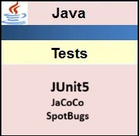

## Hi there 👋

Mes hobbies:

    

   Codewars est une plateforme d’entraînement au code qui propose des défis appelés kata, classés par niveaux de difficulté. Elle permet d’améliorer ses compétences en programmation, de découvrir de nouvelles approches algorithmiques et de comparer ses solutions avec celles d’autres développeurs du monde entier.

Mes technologies..

    

   

   
  
  
  
   

  
  
  
  

  
  
  

   

  

  
  
  
  

  
            

  
            

                   
          

- 🔭 I’m currently working on ...
- 🌱 I’m currently learning ...
- 👯 I’m looking to collaborate on ...
- 🤔 I’m looking for help with ...
- 💬 Ask me about ...
- 📫 How to reach me: ...
- 😄 Pronouns: ...
- ⚡ Fun fact: ...
  -->
